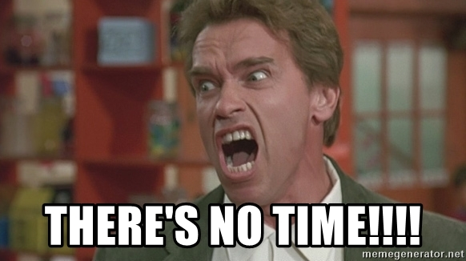

# Project0 - TicTacToe

## Current stage

### 1. Improving AI moves
> Teach it to win

### 2. Add image token and enable selection

### 3. Restructuring js files.
> To have localStorage and ai in separate files.

### 4. Debugging
    * disable click on buttons and input during while game is on
    * formatting issues here and there
    * local storage debugging
    * other unknown ones
    * unexhausted list

## So

___Estimated deliver time:___  2020 for README.md

# __Thanks for your patiences!!!__  
